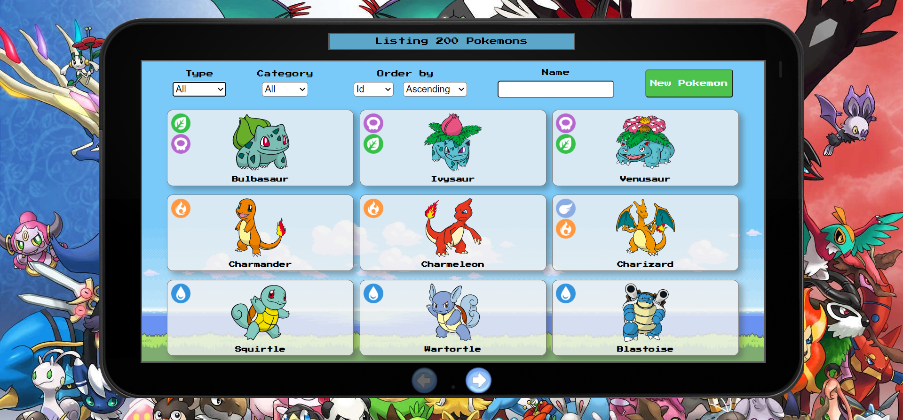
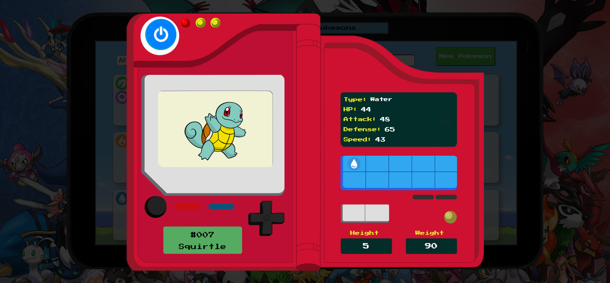
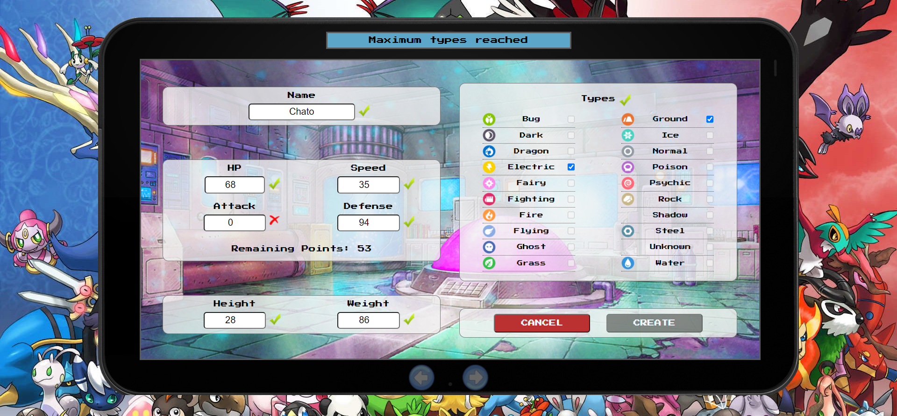

# Pokemon App

## Link a deploy: 
- Versión Web: https://pokemon-client.web.app/  
  
## Intro

- Esta app fue realizada para la etapa "Proyecto Individual" de Labs del bootcamp Henry.
- Tiempo de desarrollo: 2 semanas. 
- No estaba permitdo usar librerías ni frameworks CSS (Boostrap, MaterialUI, etc) por lo cual todos los modales, funcionalidad de botones y estilos se realizaron utilizando HTML CSS Y JS puro.

> Realizado utilizando el stack de tecnologías HTML, CSS, Javascript, React, Redux, Node.JS, Express, Sequelize y PostgreSQL.

## Home

  

- Muestra la lista completa de Pokemons en formato de tarjetas, cada una con su nombre, imagen e ícono representativo del tipo de Pokemon al que pertenece (agua, fuego, etc). 
- Se realiza un paginando mostrando de a 9 tarjetas por página.
- En el display superior nos muestra cuántos Pokemones está listando actualmente.
- Podemos filtrar por tipo (agua, fuego, etc.) y por categoría (originales o creados por el usuario) de Pokemon.
- Dentro de lo que estamos listando, podemos cambiar el criterio y sentido del ordenamiento (id, nombre, ataque).
- Al pie de la pantalla tenemos el paginado con botones que se activan únicamente cuando son necesarios.
- El campo de búsqueda por nombre funciona reactivamente buscando en tiempo real (no se necesita presionar un botó) y devuelve la tarjeta del Pokemon buscando sólo si coincide el nombre completo (según lo solicitado para el proyecto).
- Si hacemos click sobre cualquier tarjeta nos abre la Pokedex (Detalles del Pokemon).

## Pokedex

  

- Nos muestra toda la información de ese Pokemon (id, nombre, imagen, tipo/s, y estadísticas).
- La imagen tiene una animacion donde el pokemon salta cuando el puntero está sobre él.
- Cuando cerramos el Pokedex la pantalla anterior se encuentra en el mismo estado en el que estaba.
- Para los creados por el usuario, incluye: un botón para eliminar el Pokemon, removiéndolo definitivamnete de la base de datos (con pantalla de confirmación) y botón para renombrar, realizando un update en el registro de la DB. 

## Pokelab

  

- Posee un formulario controlado donde ingresamos los datos necesarios para crear un nuevo Pokemon.
- A medida que completamos los campos, el display superior nos advierte de errores.
- Además, vemos de cada campo su estado de válido / erróneo con un ícono representativo a su lado.
- El nombre no puede ser repetido de un Pokemon ya existente (ya sea original o creado).

  

- Para los puntos de vida, velocidad, ataque y defensa, se implementó un sistema de asignación de 250 puntos como máximo; mostrando los puntos remanentes. En caso de superar el maximo permito, no se permite crear el Pokemon.
- Sólo se pueden seleccionar hasta 2 'tipos', a partir de entonces el resto queda deshabilitado. Podemos cambiar la selección y volver a elegir. 

- El boton de `CREATE` sólo se habilita si todos los campos estan aprobados.

  

- Al confirmar se realiza la operación en el servidor y nos muestra en pantalla la respuesta que nos envía el mismo (éxito o error).
- Luego al cabo de unos segundos automáticamente nos devuelve al Home.

